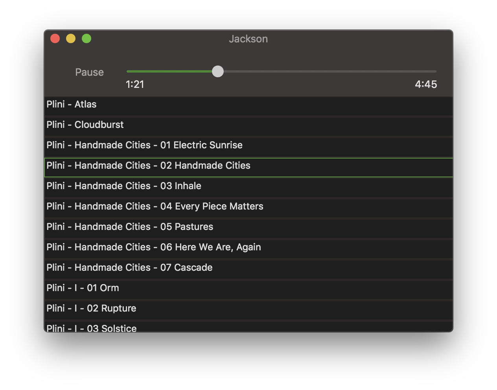

# It Jackson!
A barely working, fairly simple music player for macOS

Get it [here](https://github.com/voidref/Jackson/raw/gh-pages/Jackson.zip) if you don't want to do the download-and-compile dance.

Adding songs:

Drag a folder of songs to the UI to add them alphabetically. They will start playing

Use the mouse or arrow keys to change which song is playing

Delete an item from the list by using Edit -> Delete, or the 'delete' key

Skip around in the song using the slider

